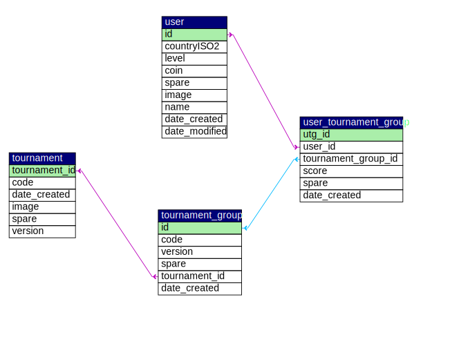
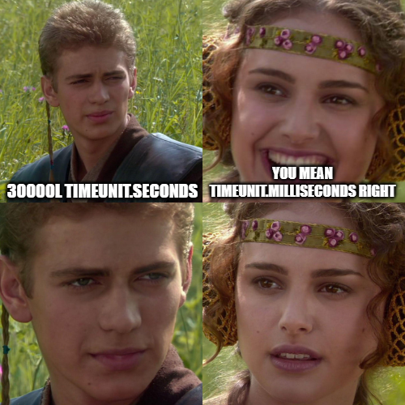

# Journal
Time I spent on this project might seem too much, but I've intertwined it with
experimenting with Spring and Spring Data JPA and adding some functionalities 
that are not normally required for this project. I used the project as an excuse
to learn more about some topics (e.g. logging, redis streams, redis queues (lists) )
which may not even be used in the project.

## 11.10
2 and half hours
- Create MySQL DB and draft tables schematic:

- Create a new Spring project with barebones (add endpoints, that's it)

## 11.11-12
1 hour
- I had established basic DB connection with handwriten SQL queries but that
level of rawness seems to be painful to maintain. Not that I can't write SQL statements,
really that is easy part, but I don't want to write all the boilerplate code
error handling, table/column names, etc.  
For the moment the kind of queries I need are simple enough to be handled by
Spring Data JPA. Especially, since, each request is a single query, so I don't get to
entertain the idea of using a single transaction for multiple queries. Even if I
write raw SQL queries[^cope].

## 11.13
2 and half hours
- I've implemented CreateUserRequest updateLevelRequest endpoints. though the latter
will need to be updated to handle tournament scorekeeping if there any.
I'm back to writing SQLs LoL. Gaining experience huh?

## 11.14 
4 hours (I don't know anymore :D )
- My tests to entering tournament logic as in the temporay `/test` endpoints seems 
promising except tha fact that I use Thread.sleep() instead of establishing pub-sub (or event listener) structure.
I've made naive attempts to use Java's Monitor concurrency pattern with wait/notifyAll methods
but it didn't work. I would have a better chance of succeding in this if I had spent
some time to testing/protyping just how Java's Monitor work. I miss the MPI and Go's channels!
- BTW I used executorService to initiate multiple requests in `/test` but it turned out
that `executorService.awaitTermination(30000l, TimeUnit.SECONDS);` is a long time to wait[^timeunits].
As it turns out the real mistake here was that I have forgotten to shutdown the executorService.
If I hadn't forgotten to shutdown the executorService, that seconds mistake woulnd't matter.
At least I could use this structure in tests to simulate multiple users. 

[^timeunits]: 

[^cope]: cope harder 